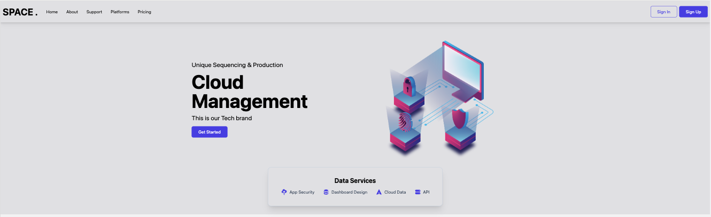

# Cloud Management front using React JS and Tailwind CSS

This is a practice to the [Build a React JS Website with Tailwind CSS - Beginner Tutorial Learning Tailwind CSS](https://www.youtube.com/watch?v=TVQnhcVFTVs&t=1504s).

### Built with

- Semantic HTML5 markup
- Flexbox
- Grid layout
- Mobile-first workflow
- React
- Tailwind CSS
- React-scroll
- Heroicons
- Remixicon

### Screenshot

